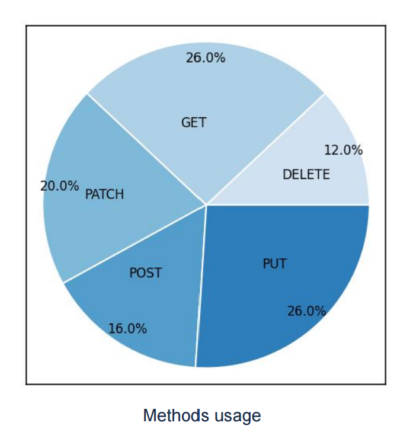
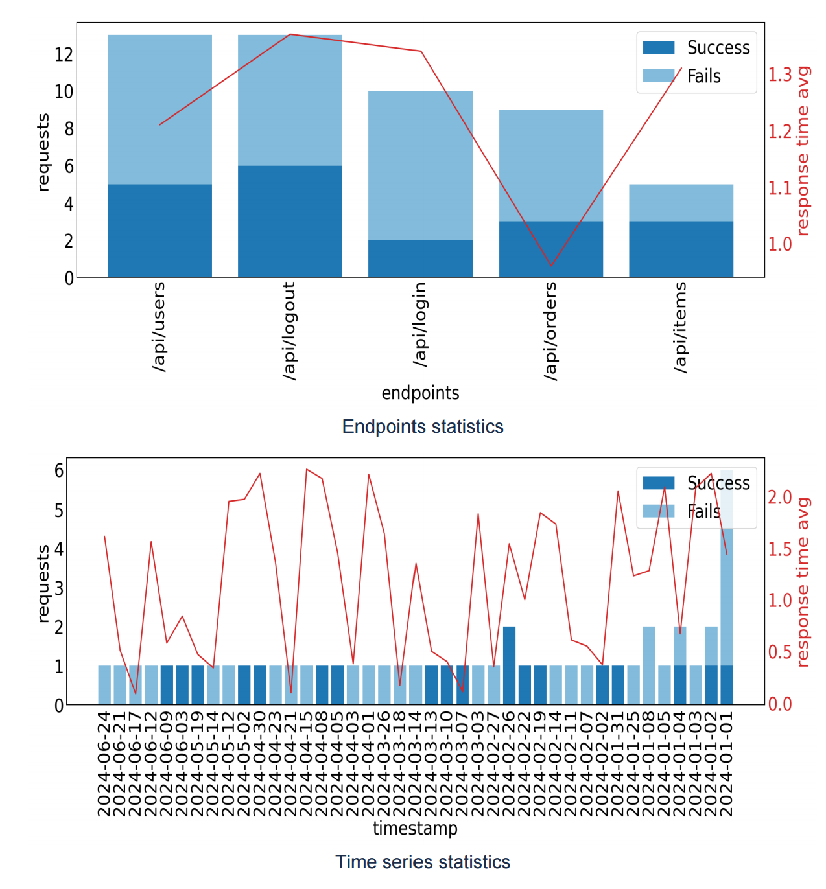

# API Analytics

FastAPI analytics service that tracks API usage (endpoints, response times, errors, etc) and displays insights. NOTE: Compatible only with FastAPI. 

[API Docs](https://fastapi-api-analytics.onrender.com/docs)

## Features

It intercepts every API request and tracks:  
- overall traffic and performance (total requests, unique IPs, average response time, error rate)
- request distribution by HTTP method
- endpoint-level metrics (per-endpoint request volume, average response time, and error count)
- status code distribution
- client activity (top IPs by request count)
- time-based metrics (requests, average response time, and error rate per timestamp (day))

## Tech Stack

- Python
- FastAPI
- SQLite
- Pydantic
- SQLAlchemy
- alembic
- matplotlib, reportlab
- pyjw
- pytest, pytest-cov (testing)
- Docker
- uv (package management)
- flake8 (linting)

## Use
1. Register by sending POST request to  `/register' endpoint with your username and password.
2. Get your access token by sending POST request to  `/token' endpoint with your username and password.
3.  Generate your unique API key by sending POST request to  `/generate_key' with your access token. 
4.  Copy folder client_middleware to your project into the same project directory as `main.py` (httpx and python-dotenv required), and add this to your `main.py`:

```
from client_middleware.middleware import create_tracking_middleware  

app = FastAPI()
app.middleware("http")(create_tracking_middleware(api_key="api-key"))
# add this and replace api-key with your generated API key
```
Set the API_BASE variable in your `.env` file.

4. Your API will now log and store all incoming requests' data.
Logs data can be viewed on  `/raw_logs` endpoint  through GET request with  your API key set as X-API-Key  and token in the headers. You can filter and order logs by date, time, method, ip, status code, endpoint, process time.

Analytics data can be viewed on `/dashboard` endpoint  via GET request with  your API key set as X-API-Key and token in the headers.

Example Response (JSON) to `/dashboard` endpoint:
```
{
    "summary": {
        "total_requests": 18500,
        "unique_ips": 450,
        "avg_response_time": 0.42,
        "min_response_time": 0.09,
        "max_response_time": 2.91,
        "error_rate": 5.3
    },
    "method_usage": {
        "GET": 10200,
        "POST": 5200,
        "PUT": 1800,
        "DELETE": 1300
    },
    "endpoint_stats": [
        {
            "endpoint": "/api/users",
            "requests": 6200,
            "avg_time": 0.36,
            "errors_count": 18
        },
        {
            "endpoint": "/api/auth",
            "requests": 4100,
            "avg_time": 0.48,
            "errors_count": 65
        },
        {
            "endpoint": "/api/products",
            "requests": 3200,
            "avg_time": 0.41,
            "errors_count": 34
        },
        {
            "endpoint": "/api/orders",
            "requests": 2500,
            "avg_time": 0.39,
            "errors_count": 27
        },
        {
            "endpoint": "/health",
            "requests": 500,
            "avg_time": 0.11,
            "errors_count": 0
        }
    ],
    "status_codes": {
        "200": 17500,
        "400": 400,
        "401": 200,
        "403": 100,
        "404": 150,
        "500": 150
    },
    "top_ips": [
        {
            "ip": "192.168.0.101",
            "requests": 640
        },
        {
            "ip": "10.0.0.23",
            "requests": 590
        },
        {
            "ip": "172.16.5.88",
            "requests": 470
        },
        {
            "ip": "192.168.0.77",
            "requests": 420
        },
        {
            "ip": "203.0.113.9",
            "requests": 395
        }
    ],
    "time_series": [
        {
            "timestamp": "2025-08-20",
            "requests": 3000,
            "avg_time": 0.43,
            "error_rate": 0.05
        },
        {
            "timestamp": "2025-08-21",
            "requests": 3600,
            "avg_time": 0.41,
            "error_rate": 0.06
        },
        {
            "timestamp": "2025-08-22",
            "requests": 4000,
            "avg_time": 0.44,
            "error_rate": 0.05
        },
        {
            "timestamp": "2025-08-23",
            "requests": 4200,
            "avg_time": 0.40,
            "error_rate": 0.04
        },
        {
            "timestamp": "2025-08-24",
            "requests": 3700,
            "avg_time": 0.42,
            "error_rate": 0.06
        }
    ]
}
```
You can download json report with dashboard via GET request with  your API key set as X-API-Key and token in the headers to '/report' endpoint and 'json' as 'format' param.

You can download pdf report with graphs based on dashboard via GET request with  your API key set as X-API-Key and token in the headers to '/report' endpoint and 'pdf' as 'format' param.

Graphs examples:



## Run with Docker
```
git clone https://github.com/vmi98/fastapi-api-analytics.git
cd fastapi-api-analytics

docker build -t fastapi-analytics .
docker run --rm -p 8000:8000 fastapi-analytics

docker run --rm fastapi-analytics uv run pytest --cov  # tests
docker run --rm fastapi-analytics uv run flake8 .  # linting

```

## Deployment Notes

Dockerized and deployed on [Render](https://fastapi-api-analytics.onrender.com/)
